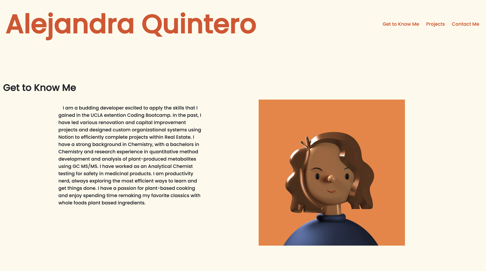

# Alejandra Quintero's Professional Website>

## Description

- What was your motivation?
    My motivation was to create a professional looking website where I could present my work and build my website as I continue on with the course. 

- Why did you build this project? 
    To practice CSS, add styling, using flexboxs and media queries to flex sections on top of each other. This would Also give my page a professional look to it. 

- What problem does it solve?
    It solves the problem of compiling my current skills and projects in a professional way. It is responsive which means that the website can be viewed on multiple different screeen sizes. There are links to my external sites such as linkedin.  

- What did you learn?
    I was able to apply flexbox elements as well as other css elements, I used a new font that I had seen from another website and used Google Fonts to apply it to my website. I also learned about making a navigation bar inherit the color of the elements rather than using default browser settings. 

## Installation

The following link will allow you to visit the professional website 

https://alejandraquintero018.github.io/Professional-Website-/

## Usage

To see the responsive elements, change the width of the page. Click on the navigation at the top right of the page to navigate to the different sections of the webpage. Click on the images of the different projects to navigate to the project attached to it. 

## Credits

I had a tutoring session with Chris Baird to change the color of the naviagtion bar from the presets to the color of the rest of the page. 

I also had help during office hours with Meg Meyers. 

I had problems with my page because I recieved two completely different approaches from the two tutors that saw for help on this page. 

I referenced this website for helping get some of the elements of flexbox: 
https://codepen.io/chriscoyier/pen/BaajoV 

I used some of the color and used the font from this personal website of a youtuber that I follow: 

https://www.mattdavella.com/ 

The following link will allow you to visit the professional website 

https://github.com/alejandraquintero018/Professional-Website-

